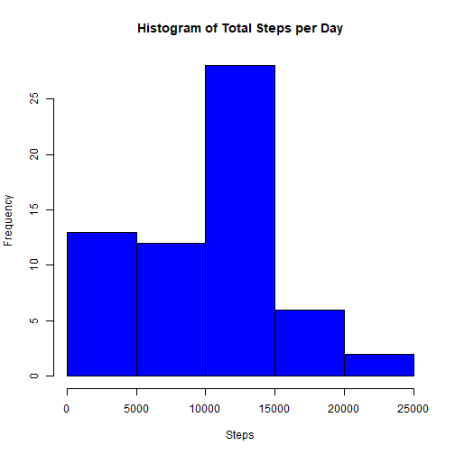
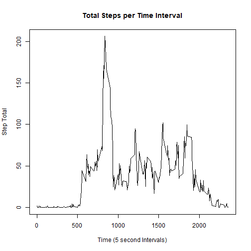
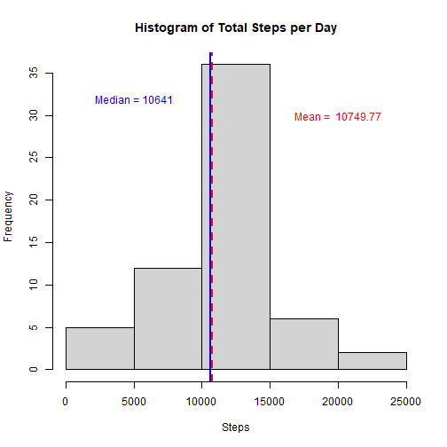
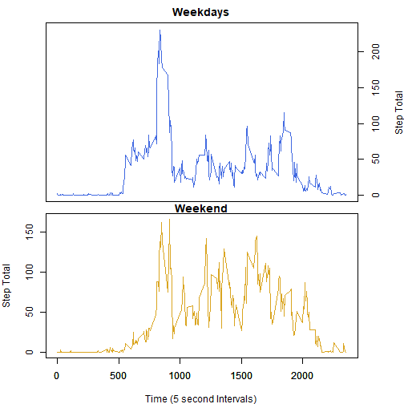

### Introduction  

It is now possible to collect a large amount of data about personal movement using activity monitoring devices such as a Fitbit, Nike Fuelband, or Jawbone Up. These type of devices are part of the "quantified self" movement -- a group of enthusiasts who take measurements about themselves regularly to improve their health, to find patterns in their behavior, or because they are tech geeks. But these data remain under-utilized both because the raw data are hard to obtain and there is a lack of statistical methods and software for processing and interpreting the data.

This assignment makes use of data from a personal activity monitoring device. This device collects data at 5 minute intervals through out the day. The data consists of two months of data from an anonymous individual collected during the months of October and November, 2012 and include the number of steps taken in 5 minute intervals each day.

### Data  

The data for this assignment can be downloaded from the course web site:

Dataset: [Activity monitoring data [52K]](https://d396qusza40orc.cloudfront.net/repdata%2Fdata%2Factivity.zip)

The variables included in this dataset are:

**steps:** Number of steps taking in a 5-minute interval (missing values are coded as NA)

**date:** The date on which the measurement was taken in YYYY-MM-DD format

**interval:** Identifier for the 5-minute interval in which measurement was taken

The dataset is stored in a comma-separated-value (CSV) file and there are a total of 17,568 observations in this dataset.

### Load Libraries


```r
library(tidyverse)
library(lattice)
```

### Load Data  

Read "activity.csv" into R. Once loaded, review characteristics  
of the dataset (variable names, variable classes,etc).


```r
activity <- read.csv("activity.csv")
str(activity)
```

```
## 'data.frame':	17568 obs. of  3 variables:
##  $ steps   : int  NA NA NA NA NA NA NA NA NA NA ...
##  $ date    : chr  "2012-10-01" "2012-10-01" "2012-10-01" "2012-10-01" ...
##  $ interval: int  0 5 10 15 20 25 30 35 40 45 ...
```

```r
head(activity)
```

```
##   steps       date interval
## 1    NA 2012-10-01        0
## 2    NA 2012-10-01        5
## 3    NA 2012-10-01       10
## 4    NA 2012-10-01       15
## 5    NA 2012-10-01       20
## 6    NA 2012-10-01       25
```

### Data Transformation  

The str() function shows that the date variable is of  
class "char". Convert it to date class  


```r
activity$date <- as.Date(activity$date, format="%Y-%m-%d")
```

## Assignment  

### **What is mean total number of steps taken per day?**  

For this part of the assignment, ignore the missing values in the  
dataset.  

      *1.* Calculate the total number of steps taken per day
      

```r
totalsteps <- activity %>%
     group_by(date) %>%
     summarise(total=sum(steps,na.rm=TRUE))
```

      *2.* Make a histogram of the total number of steps taken each day.
      

```r
hist(totalsteps$total, main="Histogram of Total Steps per Day",xlab=
     "Steps", col="blue")
```


     
      *3.* Calculate and report the mean and median of the total number of steps taken per day
      

```r
stepmean <- mean(totalsteps$total,na.rm=TRUE)
stepmean
```

```
## [1] 9354.23
```

```r
stepmedian <- median(totalsteps$total, na.rm=TRUE)
stepmedian
```

```
## [1] 10395
```

### What is the average daily activity pattern?  

Make a time series plot (i.e. type = "l") of the 5-minute interval (x-axis) and the average number of steps taken, averaged across all days (y-axis)


```r
## Sum the total number of steps for each time interval
intavg <- activity %>%
       group_by(interval) %>%
       summarise(average=mean(steps,na.rm=TRUE))

## plot intotal
plot(intavg$interval,intavg$average, type="l", 
     main="Total Steps per Time Interval", 
     xlab="Time (5 second Intervals)",
     ylab="Step Total")
```




Which 5-minute interval, on average across all the days in the dataset, contains the maximum number of steps?


```r
maxavg <- max(intavg$average)
filter(intavg,average==maxavg)
```

```
## # A tibble: 1 × 2
##   interval average
##      <int>   <dbl>
## 1      835    206.
```

### Imputing missing values  

Note that there are a number of days/intervals where there are missing values (coded as NA). The presence of missing days may introduce bias into some calculations or summaries of the data.

Calculate and report the total number of missing values in the dataset (i.e. the total number of rows with NAs)


```r
sum(is.na(activity$steps))
```

```
## [1] 2304
```

Devise a strategy for filling in all of the missing values in the dataset. The strategy does not need to be sophisticated. For example, you could use the mean/median for that day, or the mean for that 5-minute interval, etc.

Create a new dataset that is equal to the original dataset but with the missing data filled in.


```r
activity2 <- activity
l = length(activity2$interval)
for (i in 1:l)  {
         if(is.na(activity2$steps[i])) {
             x<-activity2$interval[i]
             y <- filter(intavg,interval==x)
             activity2$steps[i] <- as.integer(y$average)
         }
}

sum(is.na(activity2$steps)) ## check for NAs
```

```
## [1] 0
```

Make a histogram of the total number of steps taken each day and Calculate and report the mean and median total number of steps taken per day. 


```r
totalsteps2 <- activity2 %>%
     group_by(date) %>%
     summarise(total=sum(steps))

hist(totalsteps2$total, main="Histogram of Total Steps per Day",xlab=
     "Steps")
abline(v=mean(totalsteps2$total),lwd=2,lty=2,col="red")
text(20000,30, paste("Mean = ", round(mean(totalsteps2$total),3)),col="red")
 abline(v=median(totalsteps2$total), col="blue",lwd=2)
 text(5000,32,paste("Median =",median(totalsteps2$total)),col="blue")
```


Do these values differ from the estimates from the first part of the assignment? What is the impact of imputing missing data on the estimates of the total daily number of steps?


```r
## Create & print a table showing mean and median for both datasets
 compare <- matrix(c(stepmean,stepmedian,mean(totalsteps2$total),median(totalsteps2$total)),ncol=2,byrow=TRUE)
 colnames(compare)<- c("with NAs","   Values for NAs")
 rownames(compare) <- c("Mean","Median")
 compare<- as.table(compare)
 compare
```

```
##        with NAs    Values for NAs
## Mean    9354.23          10395.00
## Median 10749.77          10641.00
```

Are there differences in activity patterns between weekdays and weekends?
For this part the weekdays() function may be of some help here. Use the dataset with the filled-in missing values for this part.

Create a new factor variable in the dataset with two levels – “weekday” and “weekend” indicating whether a given date is a weekday or weekend day.


```r
activity2 <- activity2  %>%
  mutate(wkdy_wknd=case_when(weekdays(date)=="Sunday"|weekdays(date)=="Saturday"~"weekend",
                             TRUE~"weekday"))
activity2$wkdy_wknd <- as.factor(activity2$wkdy_wknd)

head(activity2)
```

```
##   steps       date interval wkdy_wknd
## 1     1 2012-10-01        0   weekday
## 2     0 2012-10-01        5   weekday
## 3     0 2012-10-01       10   weekday
## 4     0 2012-10-01       15   weekday
## 5     0 2012-10-01       20   weekday
## 6     2 2012-10-01       25   weekday
```

```r
## confirm that wkdy_wkend is factor of 2 levels
str(activity2)
```

```
## 'data.frame':	17568 obs. of  4 variables:
##  $ steps    : int  1 0 0 0 0 2 0 0 0 1 ...
##  $ date     : Date, format: "2012-10-01" "2012-10-01" "2012-10-01" ...
##  $ interval : int  0 5 10 15 20 25 30 35 40 45 ...
##  $ wkdy_wknd: Factor w/ 2 levels "weekday","weekend": 1 1 1 1 1 1 1 1 1 1 ...
```
Make a panel plot containing a time series plot (i.e. type = "l") of the 5-minute interval (x-axis) and the average number of steps taken, averaged across all weekday days or weekend days (y-axis). See the README file in the GitHub repository to see an example of what this plot should look like using simulated data.


```r
wkdy <- filter(activity2, wkdy_wknd=="weekday")
wknd <- filter(activity2, wkdy_wknd=="weekend")

## Avg the total number of steps for each time interval on weekdays
wkdyavg <- wkdy %>%
       group_by(interval) %>%
       summarise(average=mean(steps))

## Now do the same for weekends
wkndavg <- wknd %>%
       group_by(interval) %>%
       summarise(average=mean(steps))
```


```r
## plot weekday and weekend time series
par(mfrow= c(2,1))


par(mar=c(0,4,2,4))
plot(wkdyavg$interval,wkdyavg$average, type="l", 
     col="royalblue",main="Weekdays", 
     xlab="",xaxt="n",yaxt="n",
     ylab="")
axis(4)
mtext("Step Total", side=4,line=3)

par(mar=c(4,4,1,4))
plot(wkndavg$interval,wkndavg$average, type="l", 
     col="goldenrod",main="Weekend",
     xlab="Time (5 second Intervals)",
     ylab="Step Total")
axis(1)
```


### Submitting the Assignment  

To submit the assignment:  

Commit your completed PA1_template.Rmd file to the master branch of your git repository (you should already be on the master branch unless you created new ones)

Commit your PA1_template.md and PA1_template.html files produced by processing your R markdown file with knit2html() function in R (from the knitr package) by running the function from the console.

If your document has figures included (it should) then they should have been placed in the figure/ directory by default (unless you overrided the default). Add and commit the figure/ directory to your git repository so that the figures appear in the markdown file when it displays on github.

Push your master branch to GitHub.

Submit the URL to your GitHub repository for this assignment on the course web site.
